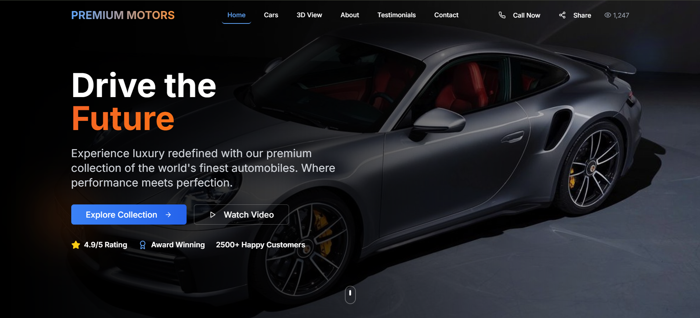

# Car-3D-web-sites

# 🚗 Car Showroom 3D Website

Bu loyiha React, Tailwind CSS va Three.js yordamida yaratilgan zamonaviy avtomobil do‘koni saytidir. 3D mashina modellar, animatsiyalar va interaktiv elementlar mavjud.

## 🛠️ Texnologiyalar

## 🛠️ Texnologiyalar


- GLB formatdagi 3D model (`porsche.glb`)

## 📸 Ekran tasviri




## 📂 3D Model

Model joylashuvi: `components/navbar.tsx`

## 🚀 Loyihani ishga tushirish

```bash
npm install
npm run dev
